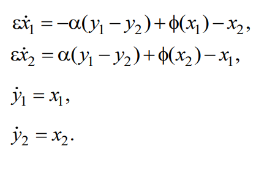

## Лабараторная работа 2
Задача номер X.9.4

Система имеет вид 

Где alpha = 1, phi(u) = -th(pi*u/2), x1(0)=x2(0)=y2(0)=0, y1(0)=2, epsilon = 10^-3

В качестве таблицы Бутчера для неявного метода была взята
|  |  |  | | |
|:-----:|:----:|:----:|:----:|:----:|
| 1/2 | 1/2 |  | | |
| 2/3 | 1/6 | 1/2 | | |
| 1/2 | -1/2 | 1/2 | 1/2 | |
| 1 | 3/2| 3/2 | -3/2 | 1/2 |
| - | 3/2 | -3/2 | 1/2 | 1/2 |

